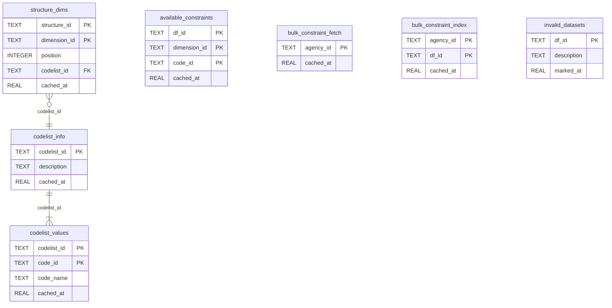

# Cache Reference

opensdmx uses local cache files stored in a provider-specific cache directory. By default this is under the OS user cache directory, for example `~/.cache/opensdmx/eurostat/` on Linux.

Cache base resolution order:

1. `OPENSDMX_CACHE_DIR`
2. `platformdirs.user_cache_dir("opensdmx")`
3. `/tmp/opensdmx-{username}` as fallback if neither location is writable

Each provider has its own isolated cache namespace. Preset providers use their provider key (`eurostat`, `istat`, `oecd`, and so on). Custom providers use `agency_id` when provided, otherwise a short hash of the base URL.

---

## Files

| File | Format | Content | TTL |
|---|---|---|---|
| `dataflows.parquet` | Parquet | Provider dataset catalog | 7 days |
| `categories.parquet` | Parquet | Provider category tree | 7 days |
| `categorisation.parquet` | Parquet | Dataflow-to-category links | 7 days |
| `embeddings.parquet` | Parquet | Semantic embeddings (per dataset) | No expiry |
| `cache.db` | SQLite | Dimensions, codelists, constraints, blacklist | Table-specific |

Examples for Eurostat and ISTAT:

```
~/.cache/opensdmx/eurostat/dataflows.parquet
~/.cache/opensdmx/eurostat/embeddings.parquet
~/.cache/opensdmx/eurostat/cache.db

~/.cache/opensdmx/istat/dataflows.parquet
~/.cache/opensdmx/istat/embeddings.parquet
~/.cache/opensdmx/istat/cache.db
```

---

## Parquet files

### `dataflows.parquet`

Downloaded from the SDMX `dataflow/{agency_id}` endpoint. Refreshed if older than 7 days.

Columns:

| Column | Type | Description |
|---|---|---|
| `df_id` | String | Dataset identifier (e.g. `une_rt_m`, `151_914`) |
| `version` | String | Dataflow version |
| `df_description` | String | Human-readable dataset name |
| `df_structure_id` | String | Referenced Data Structure Definition ID |
| `has_constraint` | Boolean/null | Whether a catalog-level constraint is known to exist for this dataflow |

### `categories.parquet` and `categorisation.parquet`

Built by `opensdmx tree` for providers that support SDMX `categoryscheme` and `categorisation` endpoints. Refreshed if either file is older than 7 days.

`categories.parquet` contains the category hierarchy. `categorisation.parquet` maps dataflows to category paths.

### `embeddings.parquet`

Built locally by `opensdmx embed` using Ollama (`nomic-embed-text-v2-moe`). Not automatically refreshed; rebuild manually when the catalog changes.

Columns:

| Column | Type | Description |
|---|---|---|
| `df_id` | String | Dataset identifier |
| `embedding` | List[Float32] | Embedding vector (dimension depends on the model) |

---

## SQLite: `cache.db`

All structured metadata is stored in a single SQLite database per provider. Each cache table has a `cached_at` column (Unix timestamp). Expiry depends on the type of metadata:

| Cache type | TTL | Environment override |
|---|---:|---|
| Dataflow catalog | 7 days | `OPENSDMX_DATAFLOWS_CACHE_TTL` |
| Category tree | 7 days | `OPENSDMX_CATEGORIES_CACHE_TTL` |
| Structure dimensions and codelists | 30 days | `OPENSDMX_METADATA_CACHE_TTL` |
| Available constraints | 7 days | `OPENSDMX_CONSTRAINTS_CACHE_TTL` |

### Tables

#### `structure_dims`

Dimension metadata for a Data Structure Definition (fetched from the `datastructure` endpoint).

| Column | Type | Notes |
|---|---|---|
| `structure_id` | TEXT | SDMX structure ID — PK part |
| `dimension_id` | TEXT | Dimension code (e.g. `FREQ`, `REF_AREA`) — PK part |
| `position` | INTEGER | Position in the SDMX key (1-based) |
| `codelist_id` | TEXT | References a codelist in `codelist_info` |
| `cached_at` | REAL | Unix timestamp |

#### `codelist_info`

Human-readable description of a codelist (e.g. "Frequency of collection").

| Column | Type | Notes |
|---|---|---|
| `codelist_id` | TEXT | PK |
| `description` | TEXT | Label in English |
| `cached_at` | REAL | Unix timestamp |

#### `codelist_values`

Individual code entries within a codelist (e.g. `A = Annual`).

| Column | Type | Notes |
|---|---|---|
| `codelist_id` | TEXT | FK → `codelist_info` — PK part |
| `code_id` | TEXT | Code value (e.g. `A`, `IT`) — PK part |
| `code_name` | TEXT | Human-readable label |
| `cached_at` | REAL | Unix timestamp |

#### `available_constraints`

Codes actually present in a dataset, fetched from the `availableconstraint` (or `contentconstraint`) endpoint. More reliable than codelist values for filter selection because not all theoretically valid codes are present in every dataset.

| Column | Type | Notes |
|---|---|---|
| `df_id` | TEXT | Dataset ID — PK part |
| `dimension_id` | TEXT | Dimension code — PK part |
| `code_id` | TEXT | Available code — PK part |
| `cached_at` | REAL | Unix timestamp |

On write, the existing rows for `df_id` are deleted before re-inserting, so the table always reflects the latest constraint snapshot.

#### `bulk_constraint_fetch`

Tracks provider-level bulk constraint fetches, used by providers such as ISTAT that support catalog-level `contentconstraint` discovery.

| Column | Type | Notes |
|---|---|---|
| `agency_id` | TEXT | Provider agency ID — PK |
| `cached_at` | REAL | Unix timestamp |

#### `bulk_constraint_index`

Stores which dataflows were covered by a successful bulk constraint fetch.

| Column | Type | Notes |
|---|---|---|
| `agency_id` | TEXT | Provider agency ID — PK part |
| `df_id` | TEXT | Dataset ID — PK part |
| `cached_at` | REAL | Unix timestamp |

#### `invalid_datasets`

Datasets that failed an API availability check (triggered during `guide`). These are excluded from all future searches and listings. There is no automatic expiry; entries must be removed manually via `opensdmx blacklist`.

| Column | Type | Notes |
|---|---|---|
| `df_id` | TEXT | PK |
| `description` | TEXT | Dataset name at the time of marking |
| `marked_at` | REAL | Unix timestamp |

---

## ER diagram


